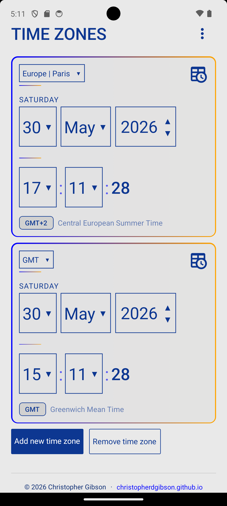
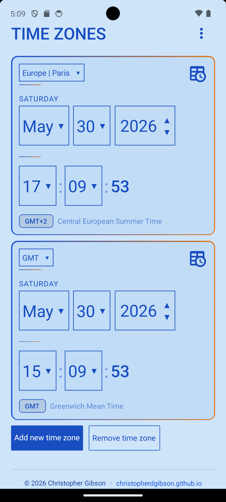

# TZComp

A cross-platform timezone comparison app built with React Native and Expo. Compare multiple timezones side by side, customise the appearance with colour themes and gradient accents, and adjust display settings to suit your preferences.

Built as a portfolio piece and ported from a WordPress plugin to gain familiarity with React Native.

## Features

- Compare multiple timezones simultaneously with live clock cards
- Add and remove timezone cards dynamically
- Select local time to compare across timezones
- Searchable timezone dropdown with custom number inputs
- Reset button restores time to current
- Customisable colour themes (presets + custom gradient picker)
- 12h/24h time format toggle
- Configurable date format
- Runs on Android, iOS, and web from a single codebase

## Screenshots

<p>
  
  
</p>

## Tech Stack

- [Expo](https://expo.dev) SDK 52
- [React Native](https://reactnative.dev)
- [Expo Router](https://expo.github.io/router) for file-based navigation
- [expo-linear-gradient](https://docs.expo.dev/versions/latest/sdk/linear-gradient/) for gradient borders and accents
- [@expo/vector-icons](https://icons.expo.fyi) for iconography
- Custom theme system with runtime accent colour switching
- Custom components throughout — dropdowns, number inputs, colour panels

## Getting Started

### Prerequisites

- [Node.js](https://nodejs.org) v20 LTS
- [Expo Go](https://expo.dev/client) on your device, or Android Studio for emulation

### Installation

```bash
git clone https://github.com/christopherdgibson/tzcomp.git
cd tzcomp
npm install
npx expo start
```

Press `w` to open in browser, `a` for Android emulator, or scan the QR code with Expo Go.

### Building for Android

```bash
cd android
.\gradlew.bat assembleRelease
```

Output: `android/app/build/outputs/apk/release/app-release.apk`

## Architecture

TZComp is built entirely with custom components — no third-party UI libraries. The architecture is organised around a few core ideas:

**Theme system** — a `buildTheme` function derives all colours from four base values (background, font colour, and two accent colours) using a JavaScript implementation of CSS `color-mix()`. Themes are managed via React context and switch at runtime without reloading. Preset palettes are provided, with full custom colour support for background, font, and gradient accents independently.

**Settings context** — a separate `SettingsProvider` manages user preferences (time format, date format) and persists them via AsyncStorage. Any component can consume settings via the `useSettings` hook.

**Timezone logic**
- Offset calculations use `Intl.DateTimeFormat` exclusively rather than `Date.toLocaleString`, ensuring consistent behaviour across Android's Hermes engine and web.

- Comparison is anchored to a base timezone — the first card — with all subsequent cards expressing their time as an offset from this base rather than independently from UTC. This means that when the user adjusts the base time (selecting a hypothetical local time to compare), the delta propagates automatically through every card, keeping all timezones consistent relative to the chosen moment.

**Component design** — all interactive components (dropdowns, number inputs) are custom-built. Dropdowns use a Modal with `measureInWindow` positioning to render above all other content regardless of scroll position or stacking context.

## Roadmap

- Upgrade to Expo SDK 56 once Gradle compatibility on Windows is resolved
- Full custom colour picker (currently swatches only)
- SVG gradient icon support (pending `react-native-svg` stability on target SDK)

## Author

[Christopher Gibson](https://christopherdgibson.github.io) · [GitHub](https://github.com/christopherdgibson)
## License

MIT
